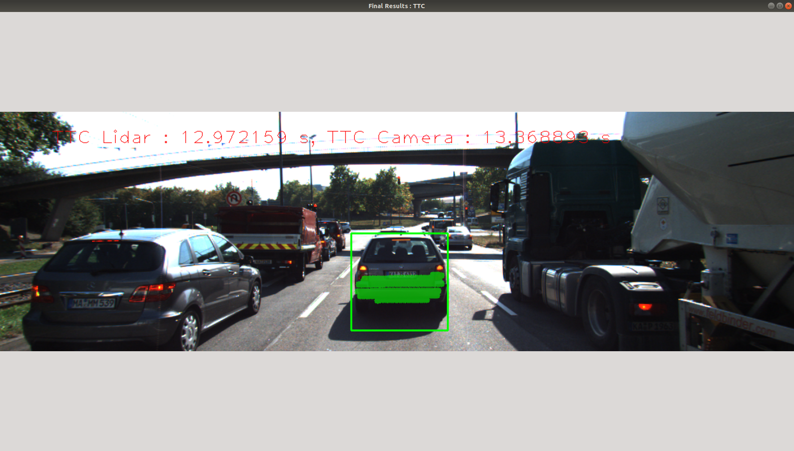
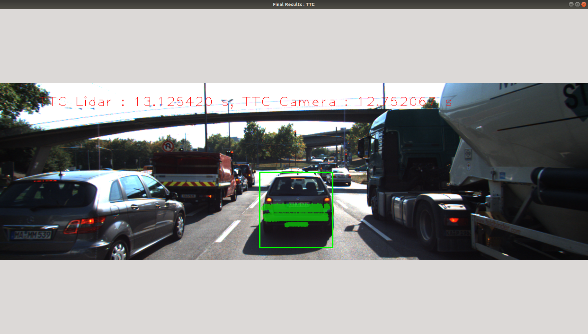
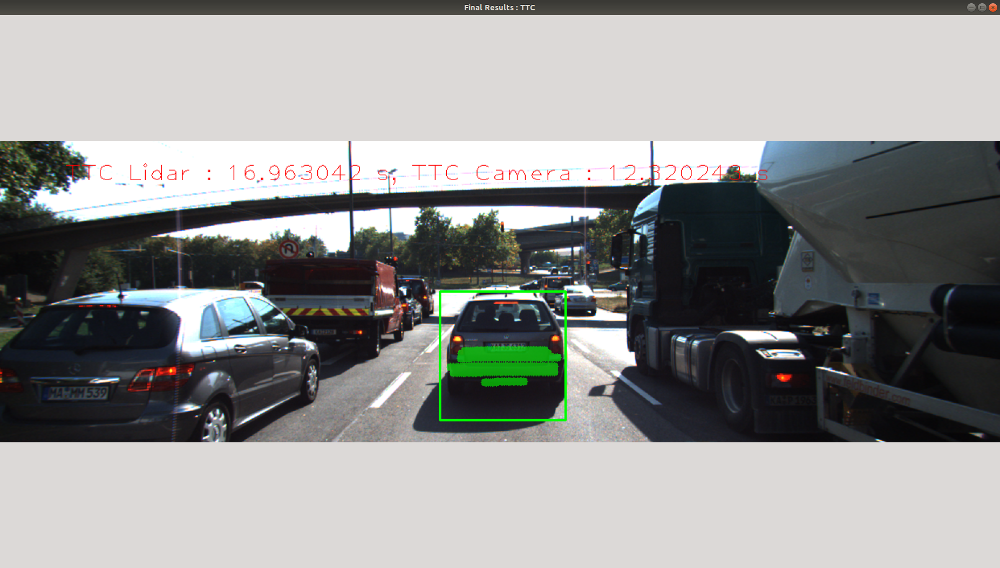
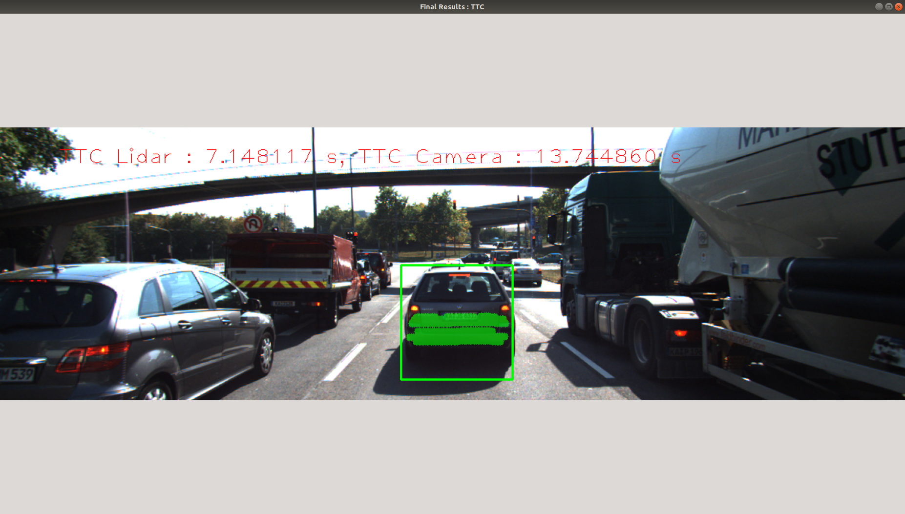
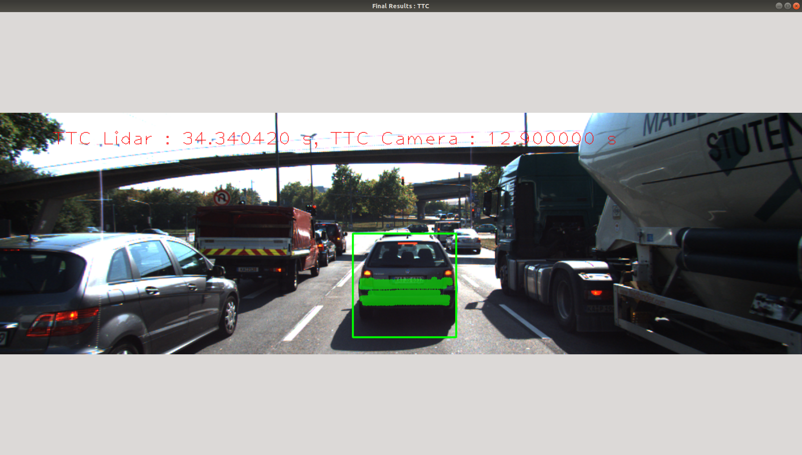
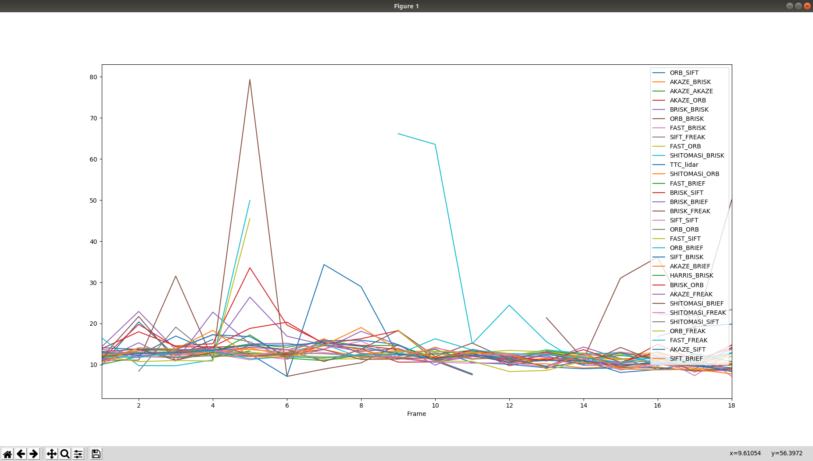

# SFND 3D Object Tracking

Welcome to the final project of the camera course. By completing all the lessons, you now have a solid understanding of keypoint detectors, descriptors, and methods to match them between successive images. Also, you know how to detect objects in an image using the YOLO deep-learning framework. And finally, you know how to associate regions in a camera image with Lidar points in 3D space. Let's take a look at our program schematic to see what we already have accomplished and what's still missing.

In this final project, you will implement the missing parts in the schematic. To do this, you will complete four major tasks: 
1. First, you will develop a way to match 3D objects over time by using keypoint correspondences. 
2. Second, you will compute the TTC based on Lidar measurements. 
3. You will then proceed to do the same using the camera, which requires to first associate keypoint matches to regions of interest and then to compute the TTC based on those matches. 
4. And lastly, you will conduct various tests with the framework. Your goal is to identify the most suitable detector/descriptor combination for TTC estimation and also to search for problems that can lead to faulty measurements by the camera or Lidar sensor. In the last course of this Nanodegree, you will learn about the Kalman filter, which is a great way to combine the two independent TTC measurements into an improved version which is much more reliable than a single sensor alone can be. But before we think about such things, let us focus on your final project in the camera course. 

## Dependencies for Running Locally
* cmake >= 2.8
  * All OSes: [click here for installation instructions](https://cmake.org/install/)
* make >= 4.1 (Linux, Mac), 3.81 (Windows)
  * Linux: make is installed by default on most Linux distros
  * Mac: [install Xcode command line tools to get make](https://developer.apple.com/xcode/features/)
  * Windows: [Click here for installation instructions](http://gnuwin32.sourceforge.net/packages/make.htm)
* Git LFS
  * Weight files are handled using [LFS](https://git-lfs.github.com/)
* OpenCV >= 4.1
  * This must be compiled from source using the `-D OPENCV_ENABLE_NONFREE=ON` cmake flag for testing the SIFT and SURF detectors.
  * The OpenCV 4.1.0 source code can be found [here](https://github.com/opencv/opencv/tree/4.1.0)
* gcc/g++ >= 5.4
  * Linux: gcc / g++ is installed by default on most Linux distros
  * Mac: same deal as make - [install Xcode command line tools](https://developer.apple.com/xcode/features/)
  * Windows: recommend using [MinGW](http://www.mingw.org/)

## Basic Build Instructions

1. Clone this repo.
2. Make a build directory in the top level project directory: `mkdir build && cd build`
3. Compile: `cmake .. && make`
4. Run it: `./3D_object_tracking`.

## Final Report

### FP.1 Match 3D Objects :

#### Task : 
Implement the method "matchBoundingBoxes", which takes as input both the previous and the current data frames and provides as output the ids of the matched regions of interest (i.e. the boxID property). Matches must be the ones with the highest number of keypoint correspondences.

For explanations about how I solved this part, please check commentaries in the code.

[Go to code](https://github.com/ThomasDegallaix/Udacity_sensorFusion_cameraCourse_3DobjTracking/blob/master/src/camFusion_Student.cpp#L157-L255)

### FP.2 : Compute Lidar-based TTC :

#### Task :
Compute the time-to-collision in second for all matched 3D objects using only Lidar measurements from the matched bounding boxes between current and previous frame. 

In order to deal with outliers that can lead to erroneous TTC estimation, I used a nearest neighboor method inspired from the Sensor fusion Lidar course with a distance threshold low enough to cluster the lidar points and remove the noisy points.

[Go to code](https://github.com/ThomasDegallaix/Udacity_sensorFusion_cameraCourse_3DobjTracking/blob/master/src/camFusion_Student.cpp#L148-L192)

### FP.3 Associate Keypoint Correspondences with Bounding Boxes

#### Task :
Prepare the TTC computation based on camera measurements by associating keypoint correspondences to the bounding boxes which enclose them. All matches which satisfy this condition must be added to a vector in the respective bounding box.

In order to deal with outliers, I computed the mean of all the euclidean distances for the associated matches. Then, I added matches with an euclidean distance below a certain trheshold based on the mean.

[Go to code](https://github.com/ThomasDegallaix/Udacity_sensorFusion_cameraCourse_3DobjTracking/blob/master/src/camFusion_Student.cpp#L135-L155)

### FP.4 Compute Camera-based TTC

#### Task :
Compute the time-to-collision in second for all matched 3D objects using only keypoint correspondences from the matched bounding boxes between current and previous frame.

[Go to code](https://github.com/ThomasDegallaix/Udacity_sensorFusion_cameraCourse_3DobjTracking/blob/master/src/camFusion_Student.cpp#L158-L209)

### FP.5 Performance Evaluation 1

#### Task :
Find examples where the TTC estimate of the Lidar sensor does not seem plausible. Describe your observations and provide a sound argumentation why you think this happened.

We can look at the lidar TTC equation which is :    TTC = minXcurr * DT / (minXprev - minXcurr)
with minXcurr being the closest point of the preceding vehicle to our vehicle in the current frame and minXprev the closest point but in the previous frame.

By retrieving the value of minXprev and minXcurr for each frame we can find out that wrong estimations come from points in the current or in the previous frame that were not filtered correclty. Their value change slightly but the fact that minXprev and minXcurr are supposed to be relatively close to each other and that the TTC equation include a division by their substraction can lead to a TTC value far from the expectations.

The first 2 samples are quiet good TTC estimations and the next 3 are erroneous.
For the good estimations we have an average of 0.06 for (minXprev - minXcurr).
and we can see that for bad estimations this value deviate slightly.

Image               | Results
--------------------| -------------------
 | minXprev - minXcurr = 7.974 - 7.913 = 0.061 
 | minXprev - minXcurr = 7.803 - 7.744 = 0.059
 | minXprev - minXcurr = 7.849 - 7.803 = 0.046
 | minXprev - minXcurr = 7.683 - 7.577 = 0.106
 | minXprev - minXcurr = 7.577 - 7.565 = 0.012

### FP.6 Performance Evaluation 2

#### Task :
Run several detector / descriptor combinations and look at the differences in TTC estimation. Find out which methods perform best and also include several examples where camera-based TTC estimation is way off. As with Lidar, describe your observations again and also look into potential reasons.

In order to evaluate the performance of each detector/descriptor combination regarding the resulting TTC we compute the average TTC difference with the results given by the Lidar.

|Detector type|Descriptor type|Average TTC diff|
|-------------|---------------|----------------|
|ORB          |SIFT           |inf             |
|AKAZE        |BRISK          |1.662           |
|AKAZE        |AKAZE          |0.88            |
|AKAZE        |ORB            |1.591           |
|BRISK        |BRISK          |0.965           |
|ORB          |BRISK          |inf             |
|FAST         |BRISK          |1.351           |
|SIFT         |FREAK          |0.786           |
|FAST         |ORB            |1.067           |
|SHITOMASI    |BRISK          |0.898           |
|SHITOMASI    |ORB            |1.118           |
|FAST         |BRIEF          |1.255           |
|BRISK        |SIFT           |1.367           |
|BRISK        |BRIEF          |0.167           |
|BRISK        |FREAK          |0.105           |
|SIFT         |SIFT           |1.936           |
|ORB          |ORB            |inf             |
|FAST         |SIFT           |1.068           |
|ORB          |BRIEF          |nan             |
|SIFT         |BRISK          |0.939           |
|AKAZE        |BRIEF          |1.628           |
|HARRIS       |BRISK          |nan             |
|BRISK        |ORB            |1.002           |
|AKAZE        |FREAK          |1.586           |
|SHITOMASI    |BRIEF          |1.596           |
|SHITOMASI    |FREAK          |1.351           |
|SHITOMASI    |SIFT           |1.382           |
|ORB          |FREAK          |nan             |
|FAST         |FREAK          |0.991           |
|AKAZE        |SIFT           |1.249           |
|SIFT         |BRIEF          |1.066           |

As we can see, the detector/descriptor combinations involving HARRIS or ORB as detector leads to very unreliable results. The other combinations give pretty good estimations compared with the lidar. Best results seem to be given by BRISK/SIFT and BRISK/BRIEF if we consider the lidar based TTC estimation reliable (which is not entirely the case as we have seen in the previous task. If we look manually frame by frame we can point out that the AKAZE/BRIEF combination seems to be pretty accurate and even better than with the lidar.). Here we do not give concerns about the processing speed and the accuracy of these combinations like in the mid term project.
